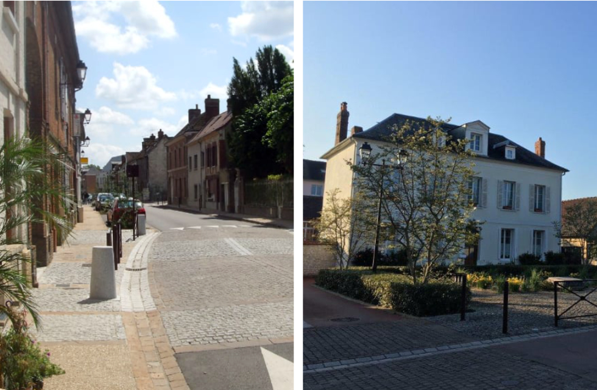

# Exposants

Comme par le passé nos fidèles exposants, pépiniéristes, horticulteurs, paysagistes, matériel de jardin, décoration, produits du terroir, etc.. viendront exposer leur savoir-faire et présenter leurs produits dans les rues du Vaudreuil. Chaque année, de nouveaux exposants rejoignent le “Salon Fleurs et Jardins”, enrichissant la diversité et assurant toujours plus de découvertes aux nombreux visiteurs.

Les producteurs présents au Salon : horticulteurs, pépiniéristes, paysagistes sont de véritables artistes, des passionnés. Ce sont les chefs étoilés d’une filière verte créatrice respectueuse de la nature. Tout est fait pour le plaisir de nos yeux émerveillés devant ce spectacle de la nature qui respire bonheur et amour. Des artistes qui vous aideront également pour optimiser vos choix selon vos envies et votre budget. Des professionnels à l’écoute qui vous conseilleront pour un jardinage facile et écologique et vous aideront à avoir la main verte.

Le Salon Fleurs et Jardins du Vaudreuil permet encore aux visiteurs de découvrir les dernières nouveautés dans le domaine de l’outillage de jardin avec des démonstrations gratuites en compagnie de professionnels réputés.

## Nos fidèles exposants

/_has-separator_/

## LE VÉGÉTAL

**LEMIRE** horticulteur -
**L.Piccoli pro** Ail des ours, Pommes bio -
**Rapmund** Bulbes et plantes -
**Les serres de la Garenne** Plantes Vivaces Annuelles -
**Madame Cactus** Collection de cactus, plantes grasses -
**Nathalie Lerouge** Tomates, Vivaces -
**Végét'Eure** Vivaces, sauges -
**Au jardin d'espérance** Plants de Fleurs et de légumes -
**Doucet Vivaces** Vivaces, Plants potagers -
**Pépinière Leclerc** Plants potager, aromatiques et fraises -
**Pépinière de la Source** Plantes d'ornement

/_has-separator_/

## AUTOUR DU JARDIN

**SANTERRE Sarah** aquareliste botanique -
**Miroiterie Franconville** Portail - Stores - Fermeture -
**Zazcat** Poteries pour le jardin -
**Kokedamas** Bougies végétales -
**Flower Bloom** Jeux de société sur le jardin -
**Gammebois** Mobilier de jardin - Bacs fleurs - Ganivelles -
**Bric à Brac** Brocante de jardinage -
**Bouton d'Eure** Minis ateliers de jardinage

/_has-separator_/

## PRODUITS NATURELS

**La Fabric d'Annick** Confiture fruits ou légumes -
**Les Ruchers de Vernon** Miels - Produits de la ruche -
**Cave Lajon** Blancs de fruits - Rhums - Jus de fruits

import Inscription from '../components/Inscription.astro';

<Inscription />

/_composant info pratique_/

import Localisation from '../components/Localisation.astro';

<Localisation />
