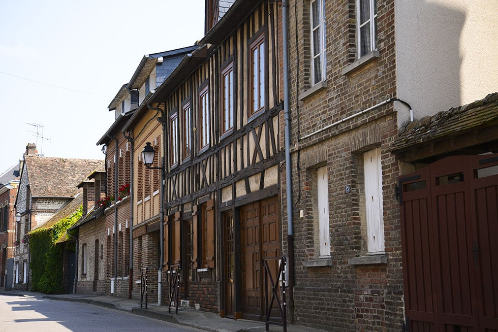

import InfoPratiques from '../components/InfoPratiques.astro';

# Informations pratiques

Vous exposez ou vous visitez le Marché Floral ? Retrouvez ci-dessous toutes les informations pour passer un agréable séjour dans notre beau village du Vaudreuil.

## Comment venir au Vaudreuil(27)

Une situation géographique idéale

Le village du Vaudreuil est situé à moins de 100 kilomètres de la région parisienne, à 20km de Rouen ou encore 120km de Caen par l’autoroute A13.

**Depuis Paris** : Autoroute de Normandie A13 sortie 19, puis suivre fléchage Salon Fleurs et Jardins

**Depuis Caen ou Rouen** : Autoroute A13, sortie 19 direction Val de Reuil puis suivre fléchage Salon Fleurs et Jardin

**En train**: gare de Val de Reuil (ligne Paris - Rouen - Le Havre)

import Button from '../components/ui/button.astro';

<Button class="mt-4 flex w-auto" variant="primary" href="" size="small">
  Plan d'accès au Marché Floral
</Button>

<Button class="mt-4 w-auto" variant="primary" href="" size="small">
  Obtenir un itinéraire
</Button>

## Restauration à proximité 

Si vous êtes plutot amateur de bonnes tables, nous vous proposons quelques restaurants proximités

- Restaurant du Golf : 02 32 50 51 51 [Voir le plan](https://www.google.fr/maps/place/Restaurant+du+Golf+PGA+France+du+Vaudreuil/@49.2599562,1.2226501,17z/data=!3m1!4b1!4m6!3m5!1s0x47e125f39882ce57:0xd7b570c814e287f1!8m2!3d49.2599562!4d1.2226501!16s%2Fg%2F1v7pxrzr?entry=ttu&g_ep=EgoyMDI1MDMxOC4wIKXMDSoJLDEwMjExNDU1SAFQAw%3D%3D)
- Restaurant La Cascade Insolite : 02 32 25 97 41

## Hébergement à proximité

En hôtel ou en gîte, il y en a pour tous les gouts

**Hôtel du Golf** : Tél. 02 32 59 02 94

**Hôtel Kyriad** : Tél. 02 32 50 61 54

**Hôtel Ibis Styles** : Tél. 02 32 59 18 19

**Hôtel Formule 1** : Tél. 08 91 70 52 78

**Hôtel Mercure** : Tél. 02 32 59 09 09

**Hostellerie Saint-Pierre**
**Saint-pierre du Vauvray**: Tél. 02 32 59 93 29

**Gîte de france**
**23 rue de l’Hôtel Dieu - Le Vaudreuil**: Tél. 02 32 59 37 58

**Fast Hôtel**: Tél. 02 32 61 06 06

**Best Hôtel**: Tél. 02 32 59 51 27

**Gîte de France**
**Rue de l’Hôtel Dieu – Le Vaudreuil** : Tél. 02 32 59 37 58

**Gîte**
**19bis rue Papavoine - Le Vaudreuil**: Tél. 02 32 59 85 55

## Loisirs autour du Vaudreuil

Si vous séjournez plusieurs jours au Vaudreuil voici quelques lieux incontournables

- Voie verte le long de l’Eure
- Golf du Vaudreuil (18 trous)
- Forêt domaniale de Bord

- [Base de loisirs de Léry-Poses](https://lery-poses.fr)
- [Serre Zoologique Biotropica](https://www.biotropica.fr)
- Parcours découverte des pâtures
